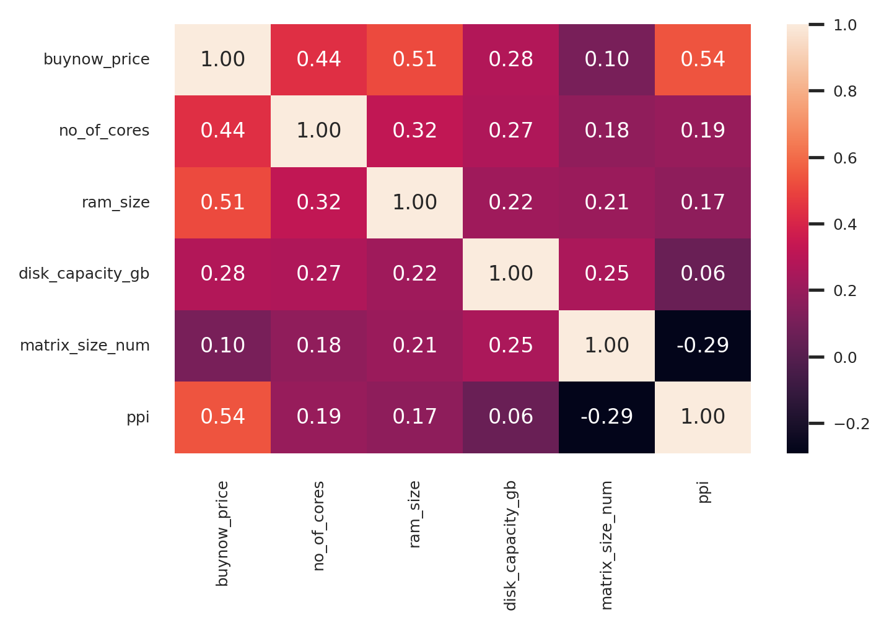
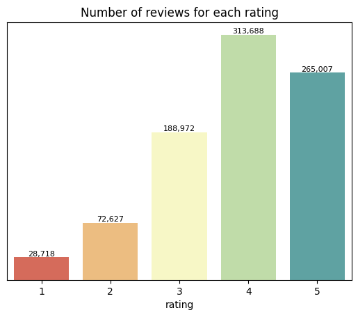
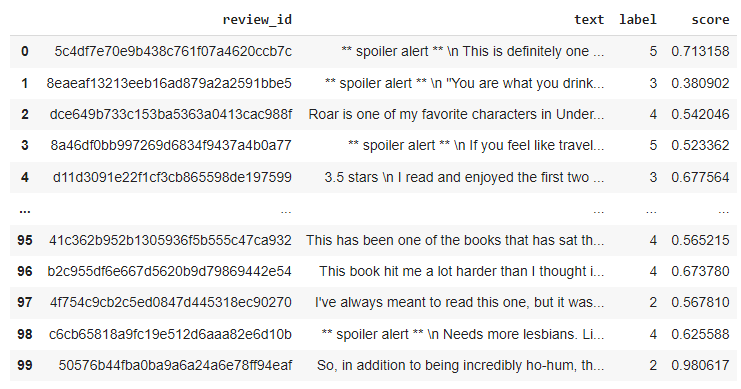
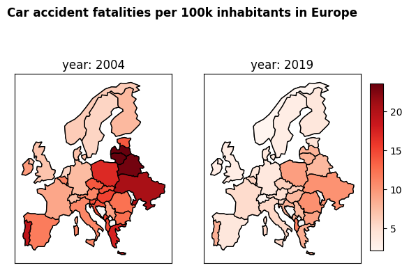

# Examples of my data science projects

## Price predictions of laptops available on marketplace

The aim of this model is to predict prices of laptops based on a set of features, e.g. processor, CPU, operational system, etc.I have tested a few models (including  random forest and XGBoost). I am showing all steps, including data check, data cleaning, preprocessing, test of different models, reduction of dimensionality and hyperparameters finetuning.
  
 
   
   

[See my notebook in Colab](https://colab.research.google.com/drive/11UuqgiCeSgkOMJCtFEUdjXbmN8PHuBQI?usp=sharing)
   

## NLP: Sentiment analysis with DistilBERT on books' reviews

In this model I was trying to predict rating of a book (0-5 star) based on a text review. For this task I decided to use a light, distilled version of BERT model, DistilBERT. It's a powerful model, bidirectional and requiring relatively low training data and computational resources, which makes it a good choice for the purpose of this project. I have fine-tuned a DistilBERT model with 90k training dataset.
  
 
   
    

[See my notebook in Colab](https://colab.research.google.com/drive/1rftEVovkyFgy5eGefBa5dbh9NW1woQBE?usp=sharing)
   

## Data visualization with geopandas - car accidents fatalities in Poland

For years Poland was ranked high among countries with the highest number of car accidents fatalities.  According to Polish Institute of Economics (PIE), Poland is the second least safe country in road traffic among OECD countries. In total, in 2021 the costs of road incidents accounted for 1.5% of Polish GDP2021, including the costs of accidents - 1.4% of GDP2021. In this project I will present how the number of car accidents fatalities changed over the years in Poland, how Poland is doing compared to other European countries and what are the main causes of car accidents in Poland.
  
 
   
   

[See my notebook in Colab](https://colab.research.google.com/drive/1Eaf6BDjqkaHXY-tKwGEVP5YMdP-0oVSW?usp=sharing)
   

### Check also my [LinkedIn](https://www.linkedin.com/in/anna-soroka-84498455/)

